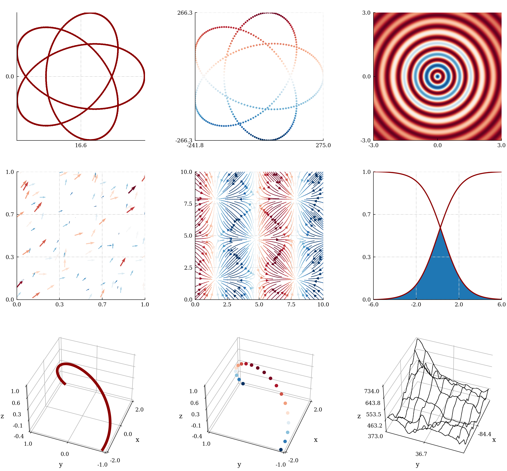

# MPL Plotter 


MPL Plotter is a Matplotlib based Python plotting library built with the goal of delivering publication-quality plots 
concisely. [The full API documentation is available here](https://mpl-plotter-docs.github.io/). Read on to get started.



### Table of Contents

[ **1. Introduction** ](#1-introduction)

[ **2. Install**  ](#2-install)

[ **3. Map of the library** ](#3-map-of-the-library)

[ **4. Getting started** ](#4-getting-started)

[ 4.1 2D ](#41-2d)

[ 4.2 3D ](#42-3d)    

[ **5. Comparisons and side by side plots** ](#5-curve-comparisons-and-multiple-pane-plots)

[ _5.1_ `comparison` ](#51-comparison)

[ _5.2_ `panes` ](#52-panes)

[ **6. Presets** ](#6-presets)

[ 6.1 Standard presets ](#61-standard-presets)

[ 6.2 Custom presets ](#62-custom-presets)

[ **7. Matplotlib** ](#7-matplotlib)

[ 7.1 Retrieving axes, figures ](#71-retrieving-axes-figures)

[ 7.2 Using Matplotlib's axis tiling ](#72-using-matplotlibs-axis-tiling)

# 1. Introduction 

Making plots for technical documents can be a time sink. MPL Plotter aims to 
reduce that overhead by allowing you to effortlessly and concisely
- Generate publication quality plots with a single call
- Plot curve [comparisons](#51-comparison)
- Create figures with [many plots](#52-panes)

It is opinionated but built with flexibility in mind, which means that
- No default can't be changed
- Any and all further customization with Matplotlib is compatible. From ticks to legends to extra axes to whatever suits your needs

There's two ways to use MPL Plotter (plus any Matplotlib before or after):
- Calls to the 2D and 3D [plotting classes](#4-getting-started)
- Using [presets](#6-presets), either those shipped with the library, or custom ones

It does the job for me and I expand it when it can't. Hope you find some use in it!

# 2. Install

`pip install mpl_plotter`

All dependencies will be checked for and installed automatically. They can be found in `setup.py` 
under `install_requires`.

### Linux

PyQt5 may fail to install in Linux, prompting the following error:

    FileNotFoundError: [Errno 2] No such file or directory: '/tmp/pip-build-4d8suz7p/PyQt5/setup.py'
    
To solve this, make sure pip is up to date and install PyQt5 5.14.0. Check this 
[ StackOverflow answer ](https://stackoverflow.com/questions/59711301/install-pyqt5-5-14-1-on-linux) for further reference.

    pip3 install --upgrade pip
    pip3 install pyqt5==5.14.0

# 3. Map of the library

This is the map of the library for import reference. 

| module | method | directory |
| --- | --- | --- |
| **module** | `method` | dir/ |

- **mpl_plotter**
    - `figure`
    - `get_available_fonts`
    - **two_d**
        - `line`
        - `scatter`
        - `heatmap`
        - `quiver`
        - `streamline`
        - `fill_area`
        - `comparison`
        - `panes`
        - `floating_text`
    - **three_d**
        - `line`
        - `scatter`
        - `surface`
        - `floating_text`
    - **presets**
        - **publication**
            - `two_d`
            - `three_d`
        - **precision**
            - `two_d`
            - `three_d`
        - **custom**
            - `two_d`
            - `three_d`
            - `generate_preset_2d`
            - `generate_preset_3d`
        - data/
            - `publication`
            - `precision`
    - **color**
        - **schemes**
            - `colorscheme_one`
            - `custom`
        - **functions**
            - `complementary`
            - `delta`
            - `mapstack`

# 4. Getting started

In this section we'll go from the the most basic plot to a fairly customized version in 2 and 3 dimensions. 
The line demo scripts can be found in `_demo/scripts/line_demos/`.

### 4.1 2D

For this example I'll use the 2D `line` class. Except for plot-specific arguments (line width etc. in this case), 
you can use the same inputs in this example with any of the other 2D plotting classes. Check the [API reference](https://mpl-plotter-docs.github.io/)
for all general and specific arguments, or call `help(<plotting class>)` in your shell to access the docstrings. 

As follows from the map above, the import to use the 2D `line` class is:

    from mpl_plotter.two_d import line

And the following is the most basic MPL Plotter call, which will generate the image below (no input, and sin wave 
respectively).
    
| `line(show=True)` | `x = np.linspace(0, 2*np.pi, 100)`<br>`y = np.sin(x)`<br>`line(x=x, y=y, show=True)` |
| --- | :--- |
|  |  

Two important features are apparent:
1. MPL Plotter provides mock plots for every plotting class, so you can get straight into action and see what each does
2. MPL Plotter is somewhat "opinionated" and sets up quite a few parameters by default. This is based purely on my 
preference. You may not agree and you're more than welcome to play around with them!

---

Two more examples (results in the table below):

1. We can add some customization to make our line look a bit better:

        line(show=True, demo_pad_plot=True, spines_removed=None)

    Our line has now some margins to breathe while the ticks are placed at the maximum and minimums of our curve, 
    and no spines are removed.

2. Lastly, an example using some of the parameters you can change:

        line(norm=True, line_width=4,
             aspect=1,
             show=True, demo_pad_plot=True,
             x_label="x", x_label_size=30, x_label_pad=-0.05,
             y_label="$\Psi$", y_label_size=30, y_label_rotation=0, y_label_pad=20,
             title="Custom Line", title_font="Pump Triline", title_size=40, title_color="orange",
             tick_color="darkgrey", workspace_color="darkred", tick_ndecimals=4,
             x_tick_number=12, y_tick_number=12,
             x_tick_rotation=35,
             color_bar=True, cb_tick_number=5, cb_pad=0.05,
             grid=True, grid_color="grey")

| 1 | 2 |
| --- | --- |
|  |  |

### 4.2 3D

Same applies in 3D.

| | Examples | |
|---|---|---|
||||

# 5. Curve comparisons and multiple pane plots

`from mpl_plotter.two_d import comparison, panes`

### 5.1 `comparison`

Plot any number of curves in a single plot. Axis limits will be set to the maximum and minimum of all your curves. 
No data will be left out, among other niceties.

As to inputs: inputs must match (2 `x`s and 3 `y`s won't work), BUT the following inputs are all valid:
|   x                      |   y                       |  result  |  notes               |
|  ---                     |  ---                      |  ---     |  ---                 |
|  array                   |  array                    |  1       |                      |
|  array                   |  [array, array]           |  2       |  Both `y`s share `x` |
|  [array, array]          |  [array, array]           |  2       |  Each `y` has an `x` |
|  [n*[array]]             |  [n*[array]]              |  n       |  Each `y` has an `x` |

As to using different plotting functions for different curves:
- You can specify a plotting function for each curve in the plot, a custom one for all curves, 
or not specify any (defaulting to lines). How? Read below (or check the code block below that). This is nice as 
it allows to concisely combine lines, scatter plots, and any other of the MPL Plotter plotting classes in a single.

As to any and all other arguments:
- **Singular arguments**: the regular MPL Plotter plotting class arguments. Apply to all curves in the plot.
- **Plural arguments**: pass a list of arguments, one for each curve. The result is as you'd imagine.

```
from mpl_plotter.two_d import comparison, line, scatter
        
def f(x, y, **kwargs):
    line(x, y,
         line_width=2,
         **kwargs)
def g(x, y, **kwargs):
    scatter(x, y,
            marker="D",
            point_size=10,
            **kwargs)
def h(x, y, **kwargs):
    scatter(x, y,
            marker="s",
            point_size=5,
            **kwargs)

comparison([x, x, x],
           [u, v, w],
           [f, g, h],
           plot_labels=["sin", "cos", "tan"],
           zorders=[1, 2, 3],
           colors=['C1', 'C2', 'C3'],
           alphas=[0.5, 0.5, 1],
           x_custom_tick_labels=[0, r"$\frac{\pi}{8}$", r"$\frac{\pi}{4}$"],
           show=show, backend=backend
           )
```


 

### 5.2 `panes`
 
The panes function allows for the plotting of a series of graphs in side-by-side panes. As to data input, the table below applies. 
It uses the `comparison`, function under the hood so the same input guidelines apply for all other inputs.

|   x                              |   y                               |  result  |  notes                                          |
|  ---                             |  ---                              |  ---     |  ---                                            |
|  array                           |  array                            |  11      |                                                 |
|  array                           |  [array, array]                   |  12      |  Both `y`s share `x`                            |
|  [n*[array]]                     |  [n*[array]]                      |  1n      |  Each `y` has an `x`                            |
|  array                           |  [array, array]                   |  21      |  Both `y`s share `x`                            |
|  [array, array]                  |  [array, array]                   |  21      |  Each `y` has an `x`                            |
|  array                           |  [n*[array], n*[array]]           |  2n      |  All curves in all (2) panes share a single `x` |
|  [array, array]                  |  [n*[array], n*[array]]           |  2n      |  All curves in each pane share an `x`           |
|  [n*[array], n*[array]]          |  [n*[array], n*[array]]           |  2n      |  All curves in all (2) panes have their own `x` |
|  [n*[array], ... up to m]        |  [n*[array], ... up to m]         |  mn      |  All curves in all panes have their own `x`     |

### Code

The following plots one curve per pane (3 in total):
     
```
panes(x,                   # Horizontal vector
      [u, v, y],           # List of curves to be plotted
      ["u", "v", "y"],     # List of vertical axis labels
      ["a", "b", "c"]      # List of legend labels 
      )
```


And the following plots an arbitrary number of curves per pane. As you can see, you just need to input 
`n` **lists** of `m` curves (where `m`=2 in the example below), and you will get a plot with `n` panes, with `m`
curves in each.
 
        panes(x,                               # Horizontal vector
              [[u, uu], [v, vv], [y, yy]],     # List of pairs of curves to be compared
              ["u", "v", "y"],                 # List of vertical axis labels
              ["a", "b"]                       # List of legend labels
              )


### Demo


And same goes for _n_ panes with a number _m_ of curves in each!

 

# 6. Presets

TL;DR: Take a parameter dictionary and forget about function inputs.

### 6.1 Standard presets

Standard presets are available to remove overhead. They're tailored for my use cases but may be useful anyway.

| |  |  |  |  |  |  |  |
| --- | --- | --- | --- | --- | --- | --- | --- |
| |  |  |  |  |  |  |  | 

#### _Publication_
It is a common mistake to make a figure for a paper with unreadable labels. This preset tries to solve that, 
generating plots optimized to be printed on a small format, in side-by-side plots or embedded in a column of text.

    from mpl_plotter.presets.precision import two_d
    from mpl_plotter.color.schemes import one           # Custom colorscheme

    x = np.linspace(0, 4, 1000)
    y = np.exp(x)
    z = abs(np.sin(x)*np.exp(x))
    
    two_d.line(x, z, aspect=0.05, color=one()[-2], show=True)
    


#### _Precision_

Made to plot functions large on the screen, with equal x and y scales to avoid skewing the variables, and 
many ticks to visually inspect a signal.

    from mpl_plotter.presets.precision import two_d
    
    two_d.line(x, z, aspect=0.05, color=one()[-2], show=True)


### 6.2 Custom presets

Example workflow follows.

| 2D |  | | | | | |
| --- | --- | --- | --- | --- | --- | --- |
| **3D** |  |  |  |  |  |

1. Use a preset creation function (`generate_preset_2d` or `generate_preset_3d`) to create a preset
    
        from mpl_plotter.presets.custom import generate_preset_2d
        
        generate_preset_2d(preset_dest="presets", preset_name="MYPRESET", disable_warning=True, overwrite=True)

   A `MYPRESET.py` file will be created in a new (or not) `presets/` directory within your project's root directory.
   
    - If no `preset_dest` is provided, `MYPRESET.py` will be saved in your root directory.
    - If no `preset_name` is provided, the preset will be saved as `preset_2d.py`.
    - By setting `disable_warning=True`, console output reminding you of the risk of rewriting your preset will be suppressed.
    - By setting `overwrite=True`, every time your run the preset creation function, it will overwrite the previously 
    created preset with the same name (rather inconvenient, but who knows when it can come in handy).

   This file has a `preset` dictionary inside, with all editable parameters inside it, and commented out. Eg:
    
        preset = { 
            # Basic 
            # "plot_label": None, 
            # Backend 
            # "backend": "Qt5Agg", 
            # Fonts 
            # "font": "serif",
            ...
        }

   By uncommenting certain lines, those parameters will be read and used to shape your plots.

2. Modify `MYPRESET.py` according to your needs.

3. Import `mpl_plotter.presets.custom.two_d` (or `three_d` if working with a 3D preset) and initiate it with `MYPRESET`
    
        from mpl_plotter.presets.custom import two_d
        
        my_preset_plot_family = two_d(preset_dir="presets", preset_name="MYPRESET")
        
        my_preset_line = my_plot_family.line
        
        # You can create further plotting classes spawning from my_preset_plot_family:
        # Eg        --->        my_preset_scatter = my_plot_family.scatter
    
4. Call a plotting function child of `two_d`, setting any extra parameters appropriately (plot title, etc.)

        my_preset_line(show=True, demo_pad_plot=True, color="blue", title="TITLE", title_size=200, aspect=1)

    The result of this example, its 3D version, and demos for all other available 2D and 3D plots can be seen in the 
    table at the beginning of the section.

5. Make as many plots as you wish.

# 7. Matplotlib
### 7.1 Retrieving axes, figures

The axis and figure on which each class draws are instance attributes. To retrieve them and continue modifications 
using standard Matplotlib:
    
    from mpl_plotter.two_d import line
    
    my_plot = line()
    ax, fig = my_plot.ax, my_plot.fig
    
With the axis and figure, most Matplotlib functions out there can be used to further modify your plots. 

### 7.2 Using Matplotlib's axis tiling

Matplotlib allows for subplot composition using `subplot2grid`. This can be used in combination with MPL Plotter:

Importantly:
- The auxiliary function `figure` (`from mpl_plotter.setup import figure`) sets up a figure in a chosen backend. 
This is convenient, as if the figure is created with `plt.figure()`, only the default non-interactive Matplotlib 
backend will be available, unless `matplotlib.use(<backend>)` is specified before importing `pyplot`.

```
from mpl_plotter import figure
from mpl_plotter.two_d import line, quiver, streamline, fill_area

backend = "Qt5Agg"  # None -> regular non-interactive matplotlib output

figure(figsize=(10, 10), backend=backend)

ax0 = plt.subplot2grid((2, 2), (0, 0), rowspan=1)
ax1 = plt.subplot2grid((2, 2), (1, 0), rowspan=1)
ax2 = plt.subplot2grid((2, 2), (0, 1), rowspan=1)
ax3 = plt.subplot2grid((2, 2), (1, 1), rowspan=1)

axes = [ax0, ax1, ax2, ax3]
plots = [line, quiver, streamline, fill_area]

for i in range(len(plots)):
    plots[i](ax=axes[i])

plt.show()
```

       

---

[Back to top](#mpl-plotter)
