# MPL Plotter

This library is a personal project I started to stop loosing time making plots while writing technical documents, as well as learn some Python along the way.
The API might change, and the defaults might not be your cup of tea, but it's saved quite some time for me, so I hope it does the trick for you!

`Antonio Lopez Rivera, 2020`

## Table of Contents

[ 1. Introduction ](#1-introduction)

[ 2. Install  ](#2-install)

[ 3. Map of the library and Capabilities ](#3-map-of-the-library-and-capabilities)

[ 4. Getting started ](#4-getting-started)

[ 5. Examples ](#5-examples)

[ 6. Matplotlib compatibility](#6-matplotlib-compatibility)

[ 7. Advanced plotting: Presets and `custom_canvas` ](#7-advanced-plotting-presets-and-custom_canvas)

[ 8. Unstable functionality: `panes` ](#8-unstable-functionality-panes)

[ 9. Contributing ](#9-contributing)

[ 10. All modifiable parameters ](#10-all-modifiable-parameters)

## 1. Introduction 

MPL Plotter is a Matplotlib based Python plotting library built with the goals of achieving publication-quality plots in an efficient and comprehensive way. 

---

The fundamental premise of MPL Plotter is to:
- Generate publication quality plots in a single function call
- Allow for any and all further customization with regular Matplotlib if needed

As a result, MPL Plotter is built with Matplotlib compatibility in mind: its capabilities expand when used in combination. Keep reading to see them in action!

---

There's three ways to use MPL Plotter:
- Calls to the 2D and 3D plotting classes. 
- Using presets, either those shipped with the library, or custom ones. 
- Calling the "decorator" `custom_canvas` class. This class won't plot anything, but rather allow you to create a customized canvas on which to plot using Matplotlib.
    
The first will be covered in Sections 3, 4 and 5. The latter, in Section 6. 

Say goodbye to hours getting your plots in shape!

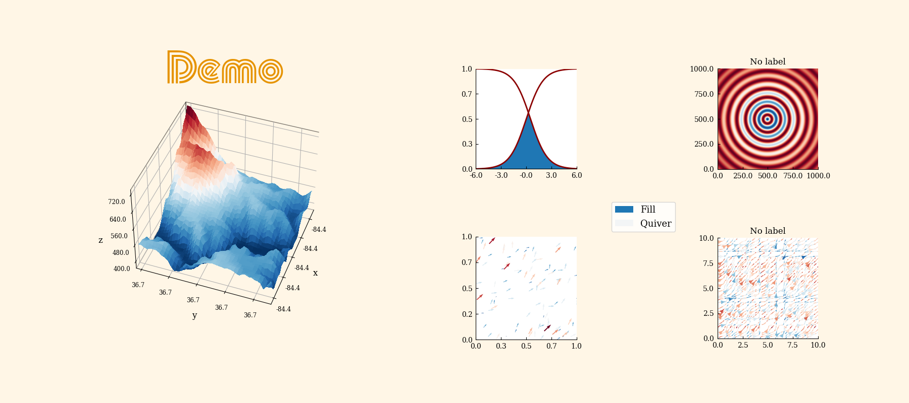

## 2. Install

`pip install mpl_plotter`

All dependencies will be checked for and installed automatically. They can be found in `setup.py` under `install_requires`

## 3. Map of the library and Capabilities

This is the map of the library, in order of relevance (and in which items will be discussed).

- mpl_plotter
    - `two_d`
        - `line`
        - `scatter`
        - `heatmap`
        - `quiver`
        - `streamline`
        - `fill_area`
        - `floating_text`
    - `three_d`
        - `line`
        - `scatter`
        - `surface`
        - `floating_text`
    - `setup`
        - `figure`
        - `custom_canvas`
    - presets/
        - `publication`
            - `two_d`
            - `three_d`
        - `precision`
            - `two_d`
            - `three_d`
        - `custom`
            - `two_d`
            - `three_d`
            - `generate_preset_2d`
            - `generate_preset_3d`
        - `panes`
            - `Lines`
                - `n_pane_single`
                - `n_pane_comparison`
        - standard/
            - `publication`
            - `precision`
    - color/
        - `maps`
        - `schemes`

With a single call, you can generate the following plots:

- 2D
  - Line plots
  - Scatter plots
  - Heatmaps
  - Quiver plots
  - Streamline plots
  - Area fills
  - Floating text
- 3D
  - Line plots
  - Scatter plots
  - Surface plots
  - Floating text

Each plot has specific parameters which can be modified, plus general ones which apply for all 2D and 3D plots respectively.
In Section 7 at the end of this README, all general parameters for 2D and 3D plots are displayed in tables.

Furthermore, MPL Plotter also allows to:

- Use a `custom_canvas` function to define a cusomized figure and axis on which to draw using Matplotlib
- Use the pre-made `publication` and `precision` presets to immediately obtain valuable plots
- Generate, customize and use 2D and 3D presets in one or many function calls
- Easily create custom linear segmented colormaps, so you can use any sequence of colors you fancy
- Custom colorschemes (currently only 1 as it's enough to fit my needs, perhaps more in the future)

## 4. Getting started

In this section we'll go from the the most basic line plot to a fairly customized version in 2D, and then 3D. The line demo scripts can be found in `_demo/line_demos/`. 

Other 2D and 3D plot examples follow.

### `4.1 2D Lines`

As follows from the map above, the import to use the 2D `line` class is:

    from mpl_plotter.two_d import line

And the following is the most basic MPL Plotter call, which will generate the image below.
    
    line(show=True)

Two important features are apparent:
1. MPL Plotter provides mock plots for every plotting class, so you can get straight into action and see what each does
2. MPL Plotter is somewhat "opinionated" and sets up quite a few parameters by default. This is based purely on my preference. You may not agree and you're more than welcome to play around with them!

---

Two more examples (result in the table below):

1. We can add some customization to make our line look a bit better:

        line(show=True, demo_pad_plot=True, spines_removed=None)

    Our plot has now some margin, the ticks are placed at the maximum and minimums of our curve, and no spines are removed.

2. Lastly, a sample of some parameters you can change, and the result.

        line(norm=True, line_width=4,
             aspect=1,
             show=True, demo_pad_plot=True,
             x_label="x", x_label_size=30, x_label_pad=-0.05,
             y_label="$\Psi$", y_label_size=30, y_label_rotation=0, y_label_pad=20,
             title="Custom Line", title_font="Pump Triline", title_size=40, title_color="orange",
             tick_color="darkgrey", workspace_color="darkred", tick_ndecimals=4,
             x_tick_number=12, y_tick_number=12,
             x_tick_rotation=35,
             color_bar=True, cb_tick_number=5, cb_pad=0.05,
             grid=True, grid_color="grey")

| 1. With some customization | 2. Customization example |
| --- | --- |
|  |  |

---

### `4.2 3D Lines`

Much of the same follows for 3D plots. In this case however customization is somewhat more limited. This is due to the fact that 1. 3D plots are less useful in general (in my experience, and thus I've spent less time on them) 2. Matplotlib support for 3D plots is more limited

|Basic|Somewhat customized|Customization example|
|---|---|---|
||||

## 5. Examples

### `5.1 2D Examples`

Sample plots. All scripts available in `tests/`

| Scatter | Heatmap | Quiver |
|---|---|---|
| 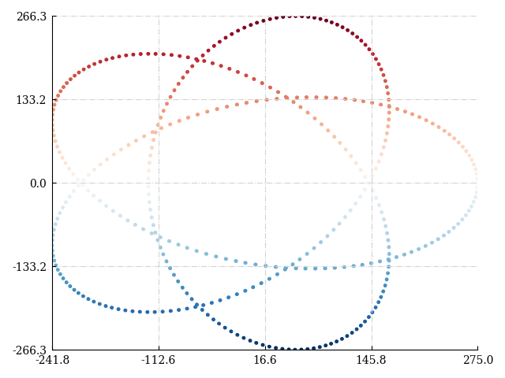 | 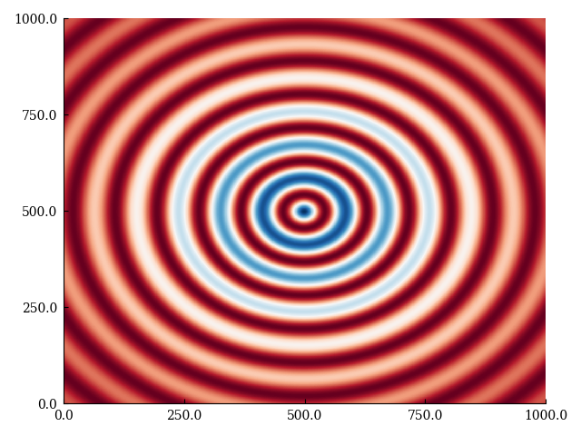 | 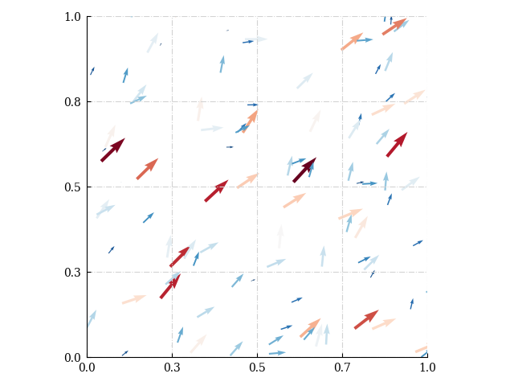 | 

| Area fill | Streamline |
|---|---|
| 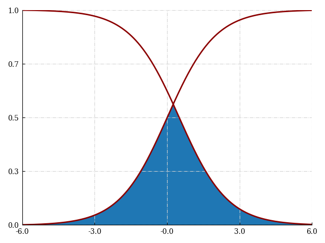 | 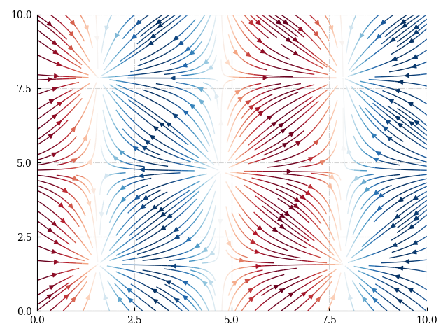 | 

### `5.2 3D Examples`

Once more the scripts are available in `tests/`

| Scatter | Surface | Wireframe |
| --- | --- | --- |
| 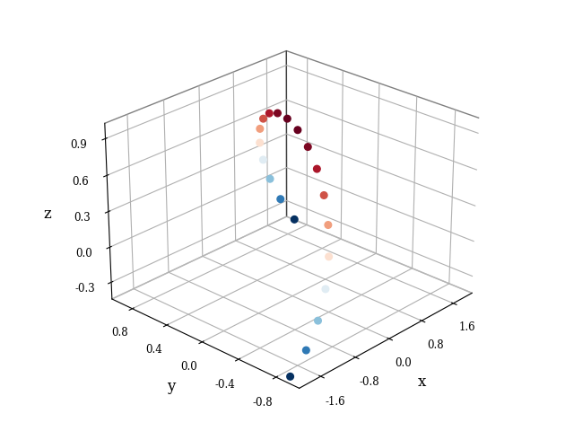 | 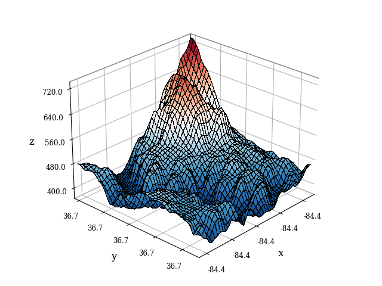 | 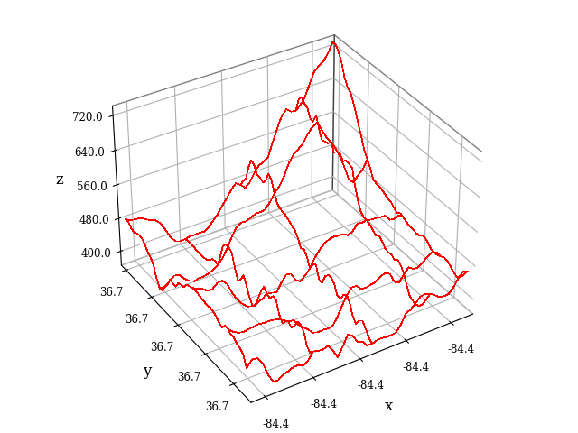 |

## 6. Matplotlib compatibility
### `6.1 Retrieving axes, figures`

The axis and figure on which each class draws are instance attributes. To retrieve them and continue modifications using standard Matplotlib:
    
    from mpl_plotter.two_d import line
    
    my_plot = line()
    ax, fig = my_plot.ax, my_plot.fig
    
With the axis and figure, most Matplotlib functions out there can be used to further modify your plots. 

### `6.2 Using Matplotlib's axis tiling`

Matplotlib allows for subplot composition using `subplot2grid`. This can be used in combination with MPL Plotter:

Importantly:
- The auxiliary function `figure` (`from mpl_plotter.setup import figure`) sets up a figure in a chosen backend. This is convenient, as if the figure is created with `plt.figure()`, only the default non-interactive Matplotlib backend will be available, unless `matplotlib.use(<backend>)` is specified before importing `pyplot`.

        backend = "Qt5Agg"  # None -> regular non-interactive matplotlib output
        
        fig = figure(figsize=(10, 10), backend=backend)
        
        ax0 = plt.subplot2grid((2, 2), (0, 0), rowspan=1, aspect=1, fig=fig)
        ax1 = plt.subplot2grid((2, 2), (1, 0), rowspan=1, aspect=1, fig=fig)
        ax2 = plt.subplot2grid((2, 2), (0, 1), rowspan=1, aspect=1, fig=fig)
        ax3 = plt.subplot2grid((2, 2), (1, 1), rowspan=1, aspect=12, fig=fig)
        
        axes = [ax0, ax1, ax2, ax3]
        plots = [line, quiver, streamline, fill_area]
        
        for i in range(len(plots)):
            plots[i](fig=fig, ax=axes[i],
                     backend=backend
                     )
        
        plt.show()
        
       
 
## 7. Advanced plotting: Presets and `custom_canvas`

The following are alternative ways to use MPL Plotter.

### `7.1 Custom presets`
Presets enable you to create plots without barely writing any code. An example workflow follows.

1. Use a preset creation function (`generate_preset_2d` or `generate_preset_3d`) to create a preset
    
        from mpl_plotter.presets.custom import generate_preset_2d
        
        generate_preset_2d(preset_dest="presets", preset_name="MYPRESET", disable_warning=True, overwrite=True)

   A `MYPRESET.py` file will be created in a new (or not) `presets/` directory within your project's root directory.
   
    - If no `preset_dest` is provided, `MYPRESET.py` will be saved in your root directory.
    - If no `preset_name` is provided, the preset will be saved as `preset_2d.py`.
    - By setting `disable_warning=True`, console output reminding you of the risk of rewriting your preset will be suppressed.
    - By setting `overwrite=True`, every time your run the preset creation function, it will overwrite the previously created preset with the same name.

   This file has a `preset` dictionary inside, with all editable parameters inside it, and commented out. Eg:
    
        preset = { 
            ## Basic 
            # "plot_label": None, 
            ## Backend 
            # "backend": "Qt5Agg", 
            ## Fonts 
            # "font": "serif",
            ...
        }
        
   By uncommenting certain lines, those parameters will be read and used to shape your plots.

2. Modify `MYPRESET.py` according to your needs.

3. Import `mpl_plotter.presets.custom.two_d` (or `three_d` if working with a 3D preset) and initiate it with `MYPRESET`
    
        from mpl_plotter.presets.custom import two_d
        
        my_preset_plot_family = two_d(preset_dir="presets", preset_name="MYPRESET")
        
        my_preset_line = my_plot_family.line
        
        # You can create further plotting classes spawning from my_preset_plot_family:
        # Eg        --->        my_preset_scatter = my_plot_family.scatter
    
4. Call a plotting function child of `two_d`, setting any extra parameters appropriately (plot title, etc.)

        my_preset_line(show=True, demo_pad_plot=True, color="blue", title="TITLE", title_size=200, aspect=1)
    
    | 2D | 3D | 
    | --- | --- |
    | 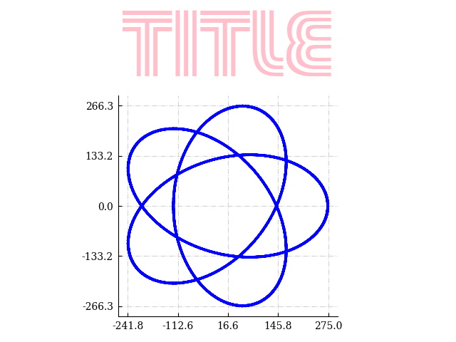 | 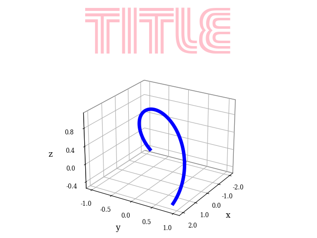 |
    
    
    
5. Make as many plots as you need. Tiling is supported as well (see `panes` in Section 8)

### `7.2 Standard presets`

Standard presets are available to remove overhead. They're tailored for my needs and desires, but perhaps you find them useful too.

#### _Publication_
It is a common mistake to make a figure for a paper with unreadable labels. This preset tries to solve that, generating plots optimized to be printed on a small format, in side-by-side plots or embedded in a column of text.

    from mpl_plotter.presets.precision import two_d
    from mpl_plotter.color.schemes import one           # Custom colorscheme

    x = np.linspace(0, 4, 1000)
    y = np.exp(x)
    z = abs(np.sin(x)*np.exp(x))
    
    two_d.line(x, z, aspect=0.05, color=one()[-2], show=True)

#### _Precision_

Made to plot functions large on the screen, with aspect ratio of 1 to avoid skewing the variables, and many ticks to visually inspect a signal.

    from mpl_plotter.presets.precision import two_d
    
    two_d.line(x, z, aspect=0.05, color=one()[-2], show=True)

| _Publication_ | _Precision_ |
| --- | --- |
| 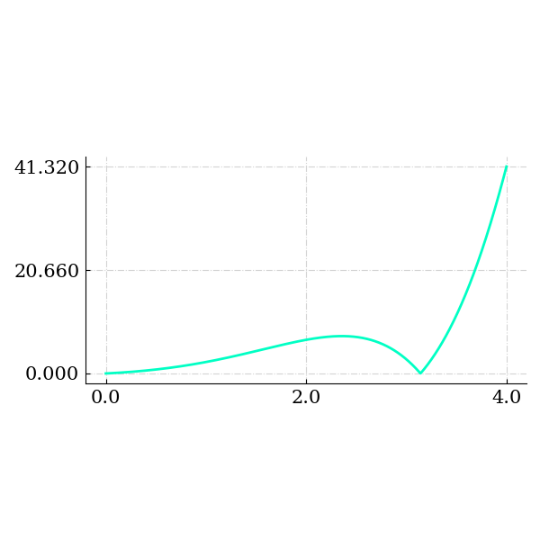 |  |

### `7.3 custom_canvas`

Lastly, MPL Plotter can be used to create a "custom canvas" on which to draw with Matplotlib.
    - `custom_canvas` creates a figure and **1**. By retrieving the figure, more axes may be created. 
    - If you wish `custom_canvas` to **resize your axes**, it must be given the `x` and `y` of (one) of your plots

_NOTE: functionality might not be at 100% yet when using `custom_canvas`+Matplotlib as compared to plotting with MPL Plotter directly._

    from mpl_plotter.setup import custom_canvas
    
    x = np.linspace(0, 2*np.pi, 100)
    y = np.sin(x)
    
    c = custom_canvas(x=x, y=y, spines_removed=None, font_color="darkred")  # x and y provided:axes are resized
    ax, fig = c.ax, c.fig
    
    # Regular Matplotlib stuff
    
    plt.plot(x, y)
    
    plt.show()
    

## 8. Unstable functionality: `panes`

_Disclaimer: The following are utilities which combine presets and axis tiling to create `n`-pane plots. 
The API is very volatile, and flexibility must be improved.
In any case, I find them practical from time to time, perhaps you too._

MPL Plotter includes a `panes` package for line plots, via the `Lines` class.
The method "map" is as follows:

- `mpl_plotter`
    - `panes`
        - `Lines`
            - `n_pane_single`
            - `n_pane_comparison`
 
 ### `8.1 n_pane_single`
 
 This function takes in a number `n` of curves, and generates an `n`-pane panel plot with them.
 
     Lines(preset=preset).n_pane_single(x,                   # Horizontal vector
                                        [u, v, y],           # List of curves to be plotted
                                        ["u", "v", "y"],     # List of vertical axis labels
                                        ["a", "b", "c"]      # List of legend labels 
                                        )  
 
  
 ### `8.2 n_pane_comparison`
 
 In turn, this function takes in a number `n` of pairs of curves, to be plotted in the same pane for comparison.
 
    Lines(preset=preset).n_pane_comparison(x,                               # Horizontal vector
                                           [[u, uu], [v, vv], [y, yy]],     # List of pairs of curves to be compared
                                           ["u", "v", "y"],                 # List of vertical axis labels
                                           ["a", "b"]                       # List of legend labels
                                           )
                                       

## 9. Contributing

There's much to be done yet. Feature suggestions or bug finds are welcome! 

## 10. All modifiable parameters

`2D`
---
| Parameter            | Default | Description  |
| ---------     | ----| -----:| 
| backend | Qt5Agg | - |
| font | serif | - |
| math_font | dejavuserif | - |
| font_color | black | - |
| fig | None | - |
| ax | None | - |
| figsize | (6 6) | - |
| shape_and_position | 111 | - |
| prune | None | - |
| resize_axes | True | - |
| aspect | None | - |
| workspace_color | None | - |
| workspace_color2 | None | - |
| background_color_figure | white | - |
| background_color_plot | white | - |
| background_alpha | 1 | - |
| style | None | - |
| light | None | - |
| dark | None | - |
| spine_color | None | - |
| spines_removed | (0 0 1 1) | - |
| x_upper_bound | None | - |
| x_lower_bound | None | - |
| y_upper_bound | None | - |
| y_lower_bound | None | - |
| x_bounds | None | - |
| y_bounds | None | - |
| demo_pad_plot | True | - |
| x_upper_resize_pad | 0 | - |
| x_lower_resize_pad | 0 | - |
| y_upper_resize_pad | 0 | - |
| y_lower_resize_pad | 0 | - |
| grid | True | - |
| grid_color | lightgrey | - |
| grid_lines | -. | - |
| color | darkred | - |
| cmap | RdBu_r | - |
| alpha | None | - |
| norm | None | - |
| title | None | - |
| title_size | 12 | - |
| title_y | 1.025 | - |
| title_weight | None | - |
title_font | Pump Triline | - |
title_color | pink | - |
| x_label | None | - |
| x_label_size | 20 | - |
| x_label_pad | 10 | - |
| x_label_rotation | None | - |
| x_label_weight | None | - |
| y_label | None | - |
| y_label_size | 20 | - |
| y_label_pad | 10 | - |
| y_label_rotation | None | - |
| y_label_weight | None | - |
| x_tick_number | 3 | - |
| x_tick_labels | None | - |
| y_tick_number | 3 | - |
| y_tick_labels | None | - |
| x_label_coords | None | - |
| y_label_coords | None | - |
| tick_color | None | - |
| tick_label_pad | 5 | - |
| ticks_where | (1 1 0 0) | - |
| tick_label_size | None | - |
| x_tick_label_size | 15 | - |
| y_tick_label_size | 15 | - |
| x_custom_tick_locations | None | - |
| y_custom_tick_locations | None | - |
| fine_tick_locations | True | - |
| x_custom_tick_labels | None | - |
| y_custom_tick_labels | None | - |
| x_date_tick_labels | False | - |
| date_format | %Y-%m-%d | - |
| tick_ndecimals | 1 | - |
| x_tick_ndecimals | None | - |
| y_tick_ndecimals | 3 | - |
| x_tick_rotation | None | - |
| y_tick_rotation | None | - |
| tick_labels_where | (1 1 0 0) | - |
| color_bar | False | - |
| cb_pad | 0.2 | - |
| cb_axis_labelpad | 10 | - |
| shrink | 0.75 | - |
| extend | neither | - |
| cb_title | None | - |
| cb_orientation | vertical | - |
| cb_title_rotation | None | - |
| cb_title_style | normal | - |
| cb_title_size | 10 | - |
| cb_top_title_y | 1 | - |
| cb_ytitle_labelpad | 10 | - |
| cb_title_weight | normal | - |
| cb_top_title | False | - |
| cb_y_title | False | - |
| cb_top_title_pad | None | - |
| x_cb_top_title | 0 | - |
| cb_vmin | None | - |
| cb_vmax | None | - |
| cb_hard_bounds | False | - |
| cb_outline_width | None | - |
| cb_tick_number | 5 | - |
| cb_ticklabelsize | 10 | - |
| tick_ndecimals_cb | None | - |
| plot_label | None | - |
| legend | False | - |
| legend_loc | upper right | - |
| legend_bbox_to_anchor | None | - |
| legend_size | 15 | - |
| legend_weight | normal | - |
| legend_style | normal | - |
| legend_handleheight | None | - |
| legend_ncol | 1 | - |
| show | False | - |
| zorder | None | - |
| filename | None | - |
| dpi | None | - |
| suppress | True | - |

`3D`
---
| Parameter            | Default  |  Description |
| :---------     | -------- | -----:|
| backend | Qt5Agg | - |
| font | serif | - |
| math_font | dejavuserif | - |
| font_color | black | - |
| fig | None | - |
| ax | None | - |
| figsize | None | - |
| shape_and_position | 111 | - |
| azim | 54 | - |
| elev | 25 | - |
| prune | None | - |
| resize_axes | True | - |
| aspect | 1 | - |
| box_to_plot_pad | 10 | - |
| spines_juggled | (1 0 2) | - |
| spine_color | None | - |
| workspace_color | None | - |
| workspace_color2 | None | - |
| background_color_figure | white | - |
| background_color_plot | white | - |
| background_alpha | 1 | - |
| style | None | - |
| light | None | - |
| dark | None | - |
| pane_fill | None | - |
| x_upper_bound | None | - |
| x_lower_bound | None | - |
| y_upper_bound | None | - |
| y_lower_bound | None | - |
| z_upper_bound | None | - |
| z_lower_bound | None | - |
| x_bounds | None | - |
| y_bounds | None | - |
| z_bounds | None | - |
| demo_pad_plot | False | - |
| x_upper_resize_pad | 0 | - |
| x_lower_resize_pad | 0 | - |
| y_upper_resize_pad | 0 | - |
| y_lower_resize_pad | 0 | - |
| z_upper_resize_pad | 0 | - |
| z_lower_resize_pad | 0 | - |
| grid | True | - |
| grid_color | lightgrey | - |
| grid_lines | -. | - |
| color | darkred | - |
| cmap | RdBu_r | - |
| alpha | 1 | - |
| title | None | - |
| title_weight | None | - |
| title_size | 12 | - |
| title_y | 1.025 | - |
title_color | pink
title_font | Pump Triline
| x_label | x | - |
| x_label_bold | False | - |
| x_label_size | 12 | - |
| x_label_pad | 7 | - |
| x_label_rotation | None | - |
| y_label | y | - |
| y_label_bold | False | - |
| y_label_size | 12 | - |
| y_label_pad | 7 | - |
| y_label_rotation | None | - |
| z_label | z | - |
| z_label_bold | False | - |
| z_label_size | 12 | - |
| z_label_pad | 7 | - |
| z_label_rotation | None | - |
| x_tick_number | 5 | - |
| x_tick_labels | None | - |
| y_tick_number | 5 | - |
| y_tick_labels | None | - |
| z_tick_number | 5 | - |
| z_tick_labels | None | - |
| x_tick_rotation | None | - |
| y_tick_rotation | None | - |
| z_tick_rotation | None | - |
| tick_color | None | - |
| tick_label_pad | 4 | - |
| tick_ndecimals | 1 | - |
| tick_label_size | 8.5 | - |
| tick_label_size_x | None | - |
| tick_label_size_y | None | - |
| tick_label_size_z | None | - |
| color_bar | False | - |
| cb_pad | 0.1 | - |
| extend | neither | - |
| cb_title | None | - |
| cb_orientation | vertical | - |
| cb_axis_labelpad | 10 | - |
| cb_tick_number | 5 | - |
| shrink | 0.75 | - |
| cb_outline_width | None | - |
| cb_title_rotation | None | - |
| cb_title_style | normal | - |
| cb_title_size | 10 | - |
| cb_top_title_y | 1 | - |
| cb_ytitle_labelpad | 10 | - |
| cb_title_weight | normal | - |
| cb_top_title | False | - |
| cb_y_title | False | - |
| cb_top_title_pad | None | - |
| cb_top_title_x | 0 | - |
| cb_vmin | None | - |
| cb_vmax | None | - |
| cb_ticklabelsize | 10 | - |
| cb_hard_bounds | False | - |
| plot_label | None | - |
| legend | False | - |
| legend_loc | upper right | - |
| legend_size | 13 | - |
| legend_weight | normal | - |
| legend_style | normal | - |
| legend_handleheight | None | - |
| legend_ncol | 1 | - |
| show | False | - |
| newplot | False | - |
| filename | None | - |
| dpi | None | - |
| suppress | True | - |
